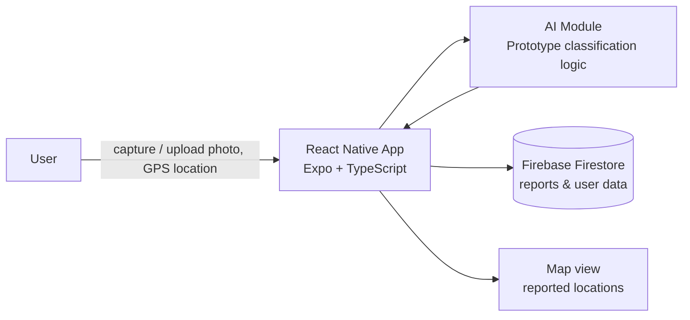

# Smart Waste Management App 🗑️♻️

**A mobile app for reporting waste issues and encouraging community-driven environmental action.**
Citizens capture and upload photos of waste (illegal dumping, overflowing bins), get an AI-assisted suggestion of the waste type, and submit a report with their GPS location. Reports appear on a map so problem areas can be identified, and users track their own environmental impact through an eco-points dashboard.

> Academic project demonstrating a mobile app for community waste reporting with an AI-assisted classification prototype, developed using Scrum over a 4-week sprint plan.

---

## The problem

Waste management in many communities is inefficient because of poor reporting systems and low awareness. Citizens often struggle to report illegal dumping or overflowing bins, which leads to environmental pollution and health risks. There is no easy way for residents to flag issues or for anyone to see where problem areas are clustered.

**The Smart Waste Management App gives residents a simple way to report waste issues, and gives the community visibility into where those issues are happening.**

## Features

| Feature | What it does |
|---|---|
| **Waste Reporting** | Upload or take a photo, add a description, select a waste type, and submit a report |
| **AI Waste Detection (Prototype)** | Scans the uploaded image, suggests a waste type, shows a confidence level, and gives recycling tips |
| **Location Tracking** | GPS-based location detection, address display, and coordinates stored with each report |
| **Dashboard Analytics** | Eco-points system, total reports count, estimated environmental impact, waste type breakdown, and insights |
| **Map Integration** | Displays reported waste locations to help identify problem areas |
| **Recycling Guide** | Provides recycling information and educates users on waste handling |
| **Collection Schedule** | Displays waste collection days to help users plan |
| **Profile Management** | View user details, access activity history, and log out |

> **Note on the AI feature:** the waste detection module is a **prototype** demonstrating the classification workflow (scan → suggested type → confidence score → recycling tip), built with simulated AI logic rather than a paid production API, due to API cost constraints during development.

---

## Architecture

**System flow**

1. **Mobile App (Frontend)** — handles UI, camera/image picker, GPS location capture, and user interaction
2. **Firebase (Backend)** — stores waste reports and user data in Firestore
3. **AI Module (Prototype)** — processes the uploaded image and returns a classification, confidence level, and recycling tip

## Tech stack

| Layer | Tools |
|---|---|
| Frontend | React Native (Expo), TypeScript |
| Backend (prototype concept) | Node.js (AI server concept) |
| Database | Firebase Firestore |
| Services | Location Services (GPS), Camera & Image Picker, AI Simulation (prototype logic) |

---

## Methodology

Built using **Scrum**, over a 4-week sprint plan:

| Sprint | Focus |
|---|---|
| Week 1 | UI design & navigation |
| Week 2 | Firebase integration |
| Week 3 | AI detection feature |
| Week 4 | Testing & improvements |

**Product backlog:** waste reporting system, AI image detection, map integration, dashboard analytics, user authentication, recycling guide, collection schedule.

## Testing

Tested manually on a physical mobile device in the Expo environment.

| Feature | Result |
|---|---|
| Login / Register | Passed |
| Image Upload | Passed |
| Camera | Passed |
| AI Scan | Passed |
| Report Submission | Passed |
| Map Display | Passed |
| Dashboard | Passed |

---

## Challenges & solutions

| Challenge | Solution |
|---|---|
| AI API cost restrictions | Used a prototype AI simulation instead of a paid production API |
| Expo notification limitations | Disabled notifications in Expo Go |
| Network connection issues | Implemented validation checks |
| Handling image processing | Optimized UI for performance |

---

## Value & impact

The application improves waste reporting efficiency, encourages community participation, promotes environmental awareness, and demonstrates a practical, if early-stage, use of AI in a mobile app.

## Roadmap

Planned next steps to move beyond the prototype:

- [ ] Real AI/ML integration to replace the simulated classification logic
- [ ] Push notifications
- [ ] Admin dashboard
- [ ] Real-time waste tracking
- [ ] Gamification (badges & rewards)

---

Academic project developed as part of coursework, demonstrating community waste reporting with an AI-assisted classification prototype.
