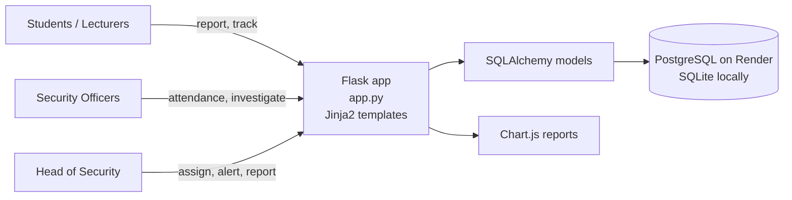

# DUT SafeAlert 🛡️

**A campus safety and incident-management web app for the Durban University of Technology (DUT).**
Students and lecturers report incidents. Security officers investigate them. The Head of Security assigns work, sends out critical alerts and tracks trends on a reporting dashboard. It covers all three Durban campuses.


> Built as a **team project for PBDV301 (Project-Based Development) at DUT (Group 3)**, March–May 2026.
> This repository is a fork of the [original team repo](https://github.com/Nomcebo-Mncwabe/Group3-PBDV301). The full commit history is kept, so every contribution stays with its author.

---

## The campuses it serves

| Ritson Campus | Steve Biko Campus | ML Sultan Campus |
|:---:|:---:|:---:|
|  |  |  |

The app uses these photos on its landing page. It also shows one of them at random as the background on every page, for a consistent campus feel.

---

## The problem

Campus security incidents (theft, harassment, suspicious activity, facility hazards) often go unreported or get stuck in informal channels. Students don't know whether anything happened after they reported something. Security management can't see which campus or incident type needs attention.

**SafeAlert gives each group in that process its own workflow on one platform:**

## Features by role

| Role | What they can do |
|---|---|
| **Student** | Register, report an incident (**optionally anonymously**), track the status of their own reports with filters (status, severity, category, date range), and see live critical alerts on their dashboard |
| **Lecturer** | Report incidents, track their own reports and receive campus-wide critical alerts |
| **Security Officer** | Sign in and out of shifts **per campus** (attendance tracking), view assigned incidents, record investigation and resolution notes, set severity and move incidents from *Pending* → *In Progress* → *Resolved* |
| **Head of Security** | Onboard and remove officers (with auto-generated `SEC####` personnel IDs), see which officers are on duty and where, assign incidents, set severity, **broadcast critical alerts** and view the **analytics dashboard** |

### Highlights

- **Role-based access control.** Separate login flows and dashboards for four user types. Security staff can't self-register; only the Head of Security can create their accounts.
- **Automatic critical alerts.** Marking an incident as *Critical* creates an "avoid the area" alert for everyone on campus. Resolving the incident clears its alerts.
- **Anonymous reporting** lowers the barrier for sensitive incidents.
- **Live duty roster.** The Head of Security can see which officers are signed in and on which campus when assigning an incident.
- **Reporting dashboard.** Chart.js charts of incidents by campus, category, severity and status.
- **Mobile-responsive UI** across every page.
- **Deployed to the cloud.** Render hosts the app with PostgreSQL. It falls back to SQLite for local development.

---

## Architecture



Full design docs are in [`Docs/`](Docs/README.md): class diagrams, the database ERD, sequence diagrams and flow diagrams.

**Data model** (`models/__init__.py`)

- `User`: accounts and roles (hashed passwords with Werkzeug)
- `Incident`: report details, severity, status, assigned officer, investigation and resolution notes
- `Alert`: priority, linked incident, delivery channel, sent flag, expiry
- `SecurityPersonnel`: officer profile, duty status, assigned site and shift, emergency contact
- `Attendance`: daily per-campus sign-in and sign-out records

## Tech stack

| Layer | Tools |
|---|---|
| Backend | Python, Flask 3, Flask-SQLAlchemy, Werkzeug security |
| Database | PostgreSQL (production), SQLite (local) |
| Frontend | Jinja2 templates, HTML/CSS, vanilla JS, Chart.js |
| Deployment | Render (`render.yaml`) |
| Collaboration | Git and GitHub: feature branches, pull requests, code review |

---

## Running it locally

```bash
git clone https://github.com/<your-username>/Group3-PBDV301.git
cd Group3-PBDV301

python -m venv venv
source venv/bin/activate        # Windows: venv\Scripts\activate
pip install -r requirements.txt

python app.py                   # creates the tables and starts on http://127.0.0.1:5000
```

Set `DATABASE_URL` to use PostgreSQL. Without it, the app uses a local SQLite file.

---

## My contribution

As a member of Group 3, I extended the **data model** so the system could support real operational use (merged via [PR #3](https://github.com/Nomcebo-Mncwabe/Group3-PBDV301/pull/3)):

- **Alert delivery tracking.** I added `sent_via` (App / SMS / Email / Push), `is_sent` and `expires_at` to `Alert`. This lays the groundwork for multi-channel notifications and for time-limited alerts that expire on their own.
- **Security deployment data.** I added `assigned_site`, `assigned_shift` (Morning / Night / 12h) and emergency contact details to `SecurityPersonnel`. This lets the Head of Security plan shift coverage across campuses.

<!-- Add any non-code work here, e.g. requirements gathering, user stories, process/UML diagrams, testing, documentation or the final presentation. -->

## The team

| Member | Main areas |
|---|---|
| Nomcebo Mncwabe | Original repo and core application, critical alert workflow |
| Devonne (`Devonne-1`) | Frontend redesign, mobile responsiveness, Render + PostgreSQL deployment, bug fixes |
| Thuledu Ndlanzi | Data model extensions for alerts and security personnel |
| Sihle (`sihle2000`) | Login page updates |

---

## Roadmap

Planned next steps to make the app production-ready:

- [ ] Load `SECRET_KEY` and the Head of Security credentials from environment variables instead of source code
- [ ] Use a single authentication decorator (e.g. Flask-Login) on every protected route, and add CSRF protection with Flask-WTF
- [ ] Send alerts through the channels in `Alert.sent_via` (email/SMS/push) and expire them with `expires_at`
- [ ] Show officer site and shift assignments in the Manage Officers UI
- [ ] Add database migrations (Flask-Migrate) and automated tests (pytest)

---

<sub>Campus photographs belong to their respective owners and are used here for non-commercial academic purposes.</sub>

